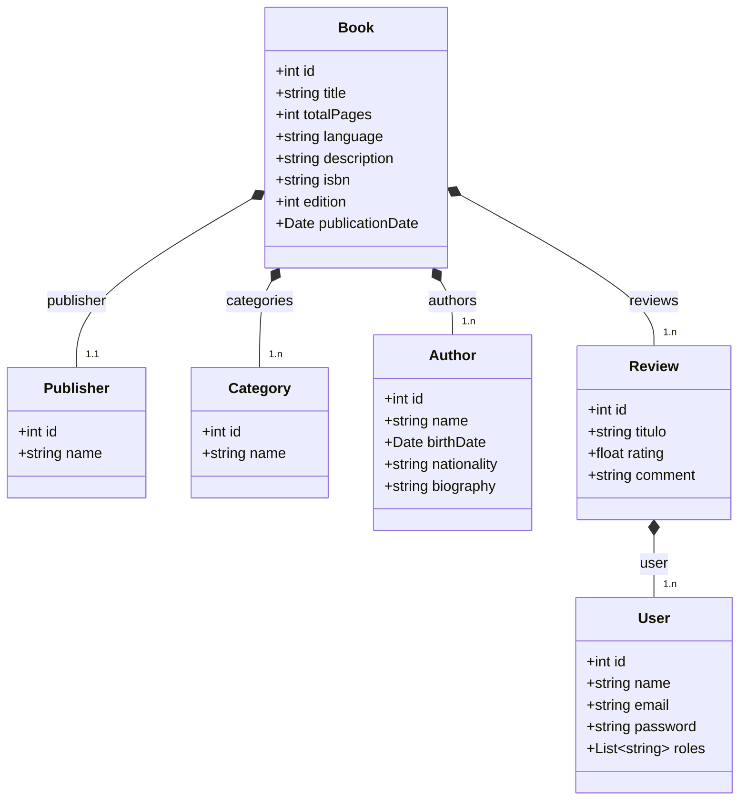

### Book Reviews API
Aplicação backend completa feita para entrega no bootcamp de Spring da DIO.

### Regras de Negócio do Projeto
- Administradores tem acesso total e podem cadastrar, atualizar, deletar e listar livros, autores, editoras, categorias, gêneros, e usuários.
- Usuários autenticados comuns podem apenas ler livros, editoras, categorias, autores, usuários e criar avaliações dos livros.
- Usuários não autenticados podem apenas ler livros, editoras, categorias, autores e avaliações.
- Somente o Administrador pode cadastrar, alterar e deletar os usuários cadastrados.

### Tecnologias Utilizadas
- Postgres(prod), H2 Database(dev)
- Spring Boot
- Spring Security
- Json Web Token
- Swagger

### Diagrama de classes UML

