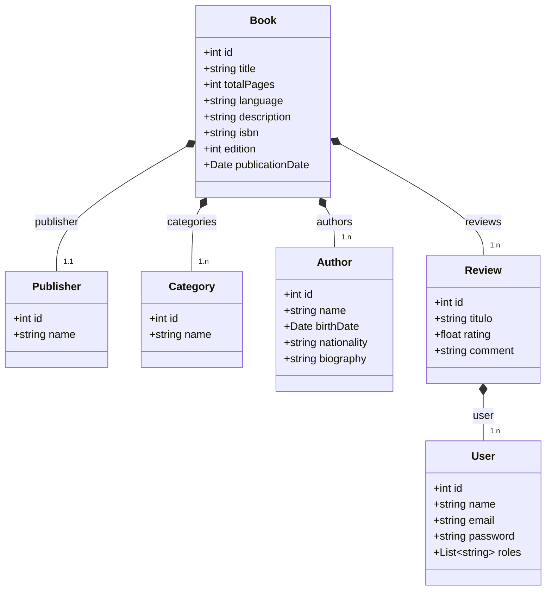

### Book Reviews API
Aplicação backend completa feita para entrega no bootcamp de Spring da DIO.

### Regras de Negócio do Projeto
- Administradores podem cadastrar, atualizar, deletar e listar livros, autores, editoras e gêneros e criar reviews dos livros.
- Usuários comuns podem apenas ler livros, editoras, autores e gêneros e criar reviews dos livros.
- Para qualquer operação além da leitura, necessita de autenticação.
- Somente o Administrador pode ler ou alterar os usuários cadastrados.

### Tecnologias Utilizadas
- Docker
- Postgres
- Spring Boot
- Spring Security
- Json Web Token
- Swagger

### Diagrama de classes UML

