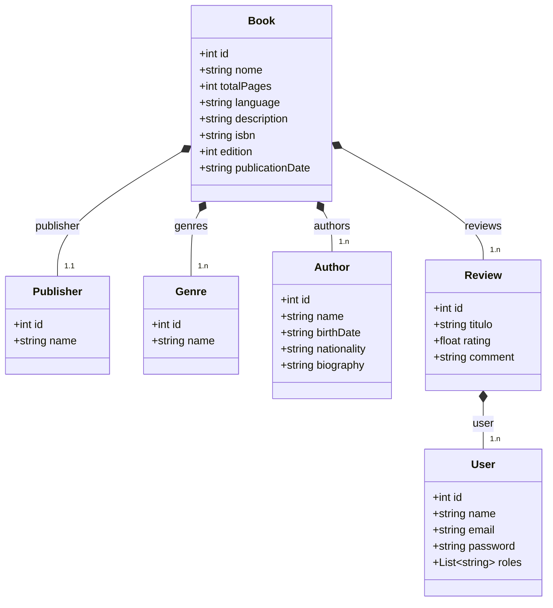

### Book Reviews API
Aplicação backend completa feita para entrega no bootcamp de Spring da DIO

### Tecnologias Utilizadas
- Docker
- Postgres
- Spring Boot
- Spring Security
- Json Web Token
- Swagger

### Diagrama de classes UML

